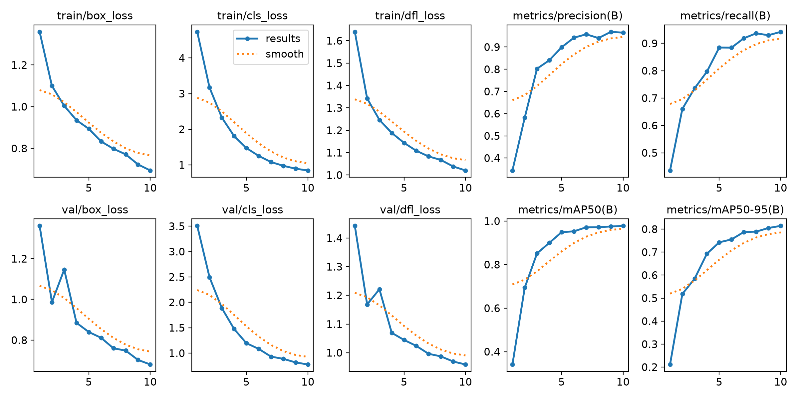
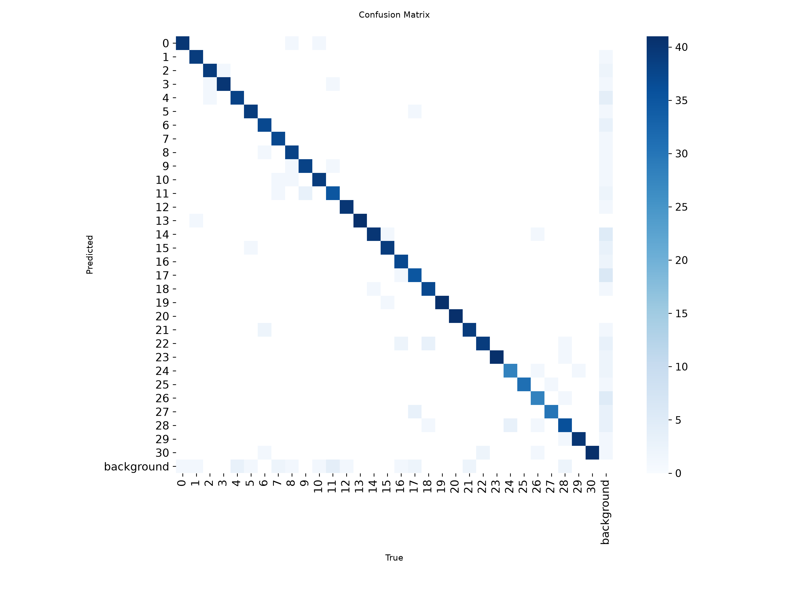
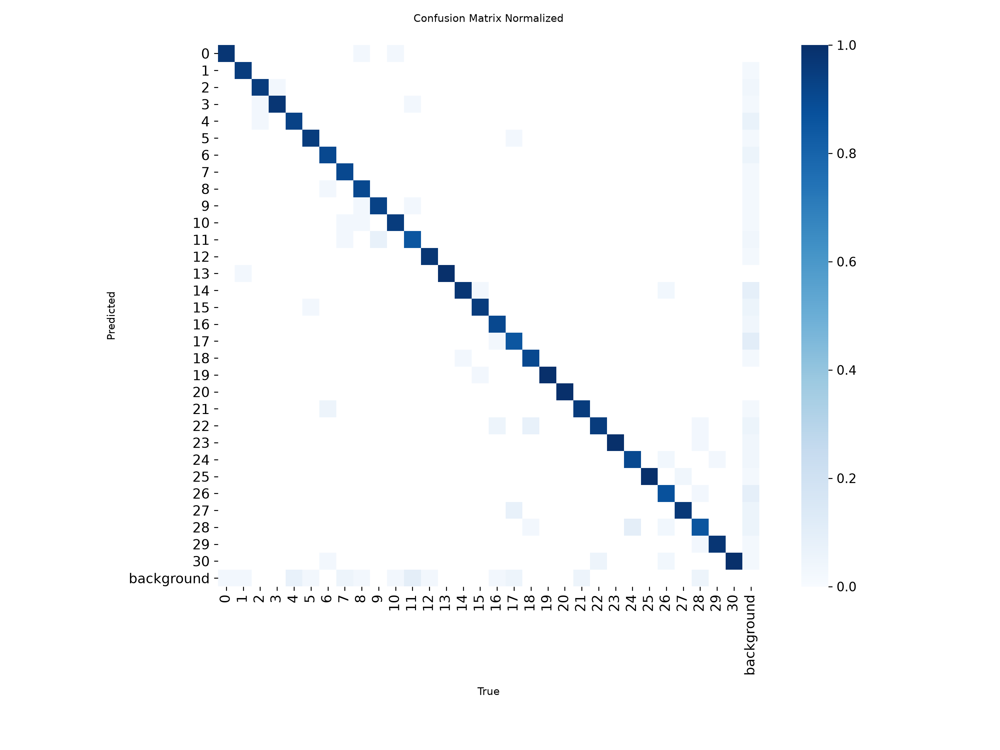
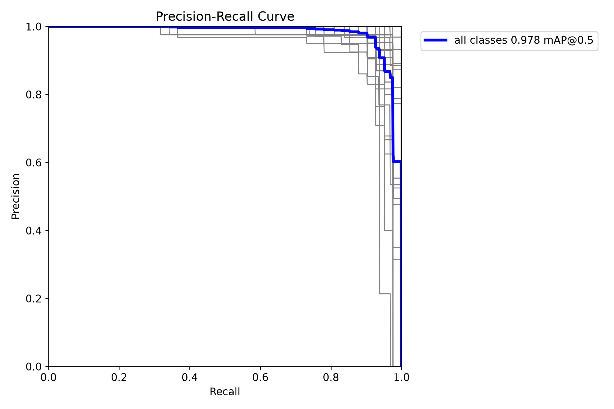
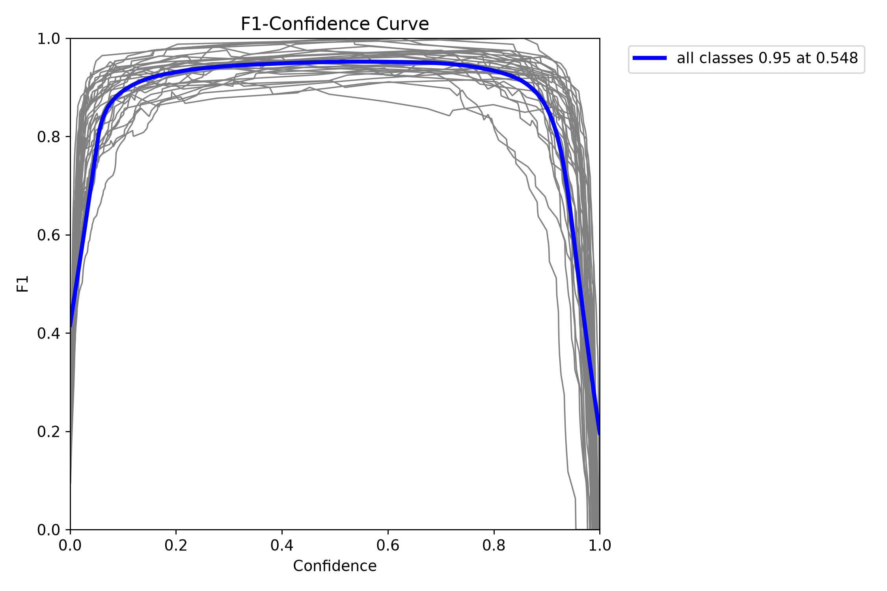
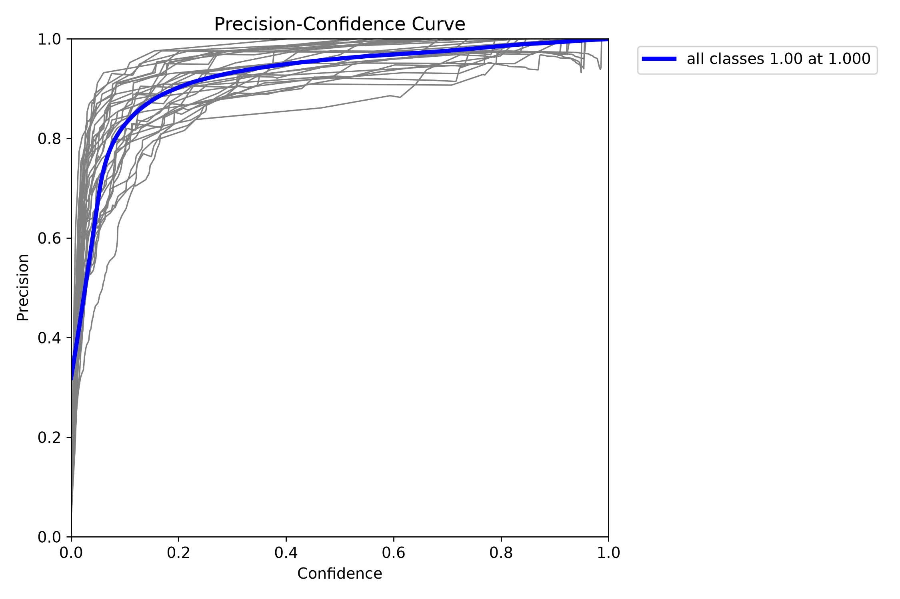
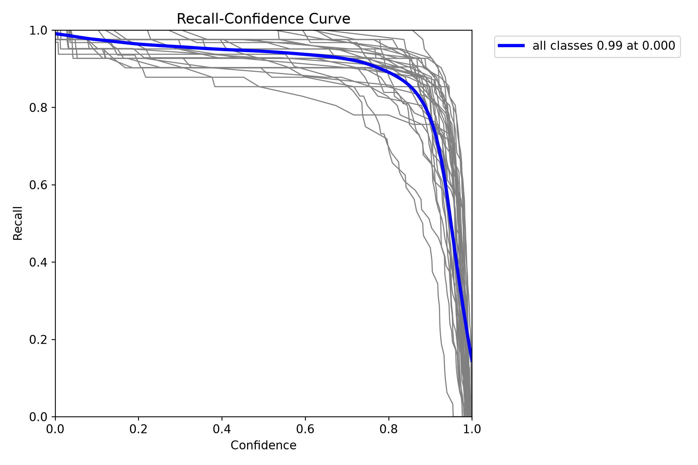
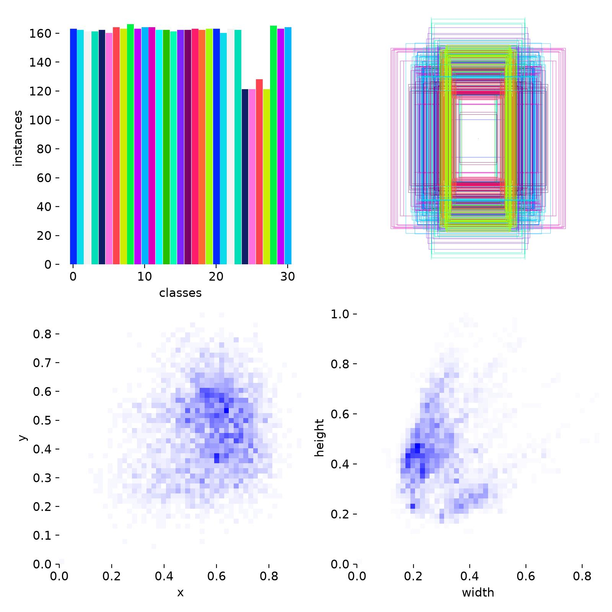

# 수어 지화(자음·모음) 인식 — YOLOv8 기반 객체 탐지 모델

MediaPipe 기반 반자동 데이터 수집 → 데이터 병합 → YOLO 포맷 변환 → YOLOv8n 학습 → 성능 평가에 이르는 전체 파이프라인을 정리한 문서입니다.

## 목차

- [1. 프로젝트 개요](#1-프로젝트-개요)
- [2. 데이터셋 구축 방법](#2-데이터셋-구축-방법)
- [3. 모델 학습 설정](#3-모델-학습-설정)
- [4. 학습 결과](#4-학습-결과)
- [5. 모델 평가](#5-모델-평가)
- [6. 데이터셋 분포 분석](#6-데이터셋-분포-분석)
- [7. 실시간 추론 테스트](#7-실시간-추론-테스트-modeltestpy)
- [8. 요약 및 특이사항](#8-요약-및-특이사항)
- [파일 구성](#파일-구성)

---

## 1. 프로젝트 개요

지화(수어의 자음·모음 손 모양)를 실시간으로 인식하기 위해 YOLOv8 객체 탐지 모델을 학습하였다. 데이터 수집부터 라벨링, 학습, 성능 평가에 이르는 전 과정을 자체 제작한 파이썬 스크립트로 수행하였다.

| 항목 | 내용 |
|---|---|
| 인식 대상(클래스) | 자음 + 모음 총 31개 (0번 ~ 30번) |
| 참여 인원 | 4명 (팀원별 `personA`, `personB`, `personC`, `personD` 폴더로 구분) |
| 1인당 수집 목표 | 클래스 1개당 50장 |
| 목표 총 데이터 수 | 31개 클래스 × 50장 × 4인 = **6,200장** |
| 라벨링 방식 | MediaPipe HandLandmarker를 이용한 반자동 바운딩 박스 추출 |
| 최종 학습 모델 | YOLOv8n (`yolov8n.pt`, Ultralytics) |

## 2. 데이터셋 구축 방법

### 2.1 반자동 라벨링 도구 (`gather_dataset.py`)

일반적인 YOLO 라벨링 프로그램은 사진 촬영 후 사람이 직접 바운딩 박스를 그려야 하므로 시간이 많이 소요된다. 이를 개선하기 위해 Google MediaPipe의 HandLandmarker를 이용해 손의 21개 랜드마크를 실시간으로 검출하고, 그 좌표의 최솟값/최댓값으로부터 바운딩 박스를 자동 계산하는 방식을 사용하였다.

- 웹캠(`cv2.VideoCapture`)으로 프레임을 받아 좌우 반전(거울 모드) 후 화면에 표시
- MediaPipe Tasks API (`vision.HandLandmarker`, `num_hands=1`)로 한 손의 21개 landmark 좌표(x, y, z) 검출
- landmark의 (x, y) 최솟값에 0.95, 최댓값에 1.05를 곱해 여유 마진을 둔 사각형을 `xmin, ymin, xmax, ymax`로 산출
- 마우스 왼쪽 클릭 시점의 원본 프레임(오버레이 없는 `clean_img`)을 이미지로 저장하고, 파일명·좌표·클래스 번호(`label`)를 `csv_list`에 누적
- 클래스 번호는 코드 상단의 `sign_number` 변수를 사람이 수동으로 바꿔가며 클래스별로 반복 실행
- 50장(`cnt>50`) 수집 시 콘솔에 완료 메시지를 출력하고, 최종적으로 `data/{클래스}/capstone_sign_{클래스}.csv`로 저장

> 촬영과 동시에 바운딩 박스 좌표가 함께 산출되므로, 별도 라벨링 프로그램을 사용하는 기존 방식 대비 약 2배의 작업 시간을 절약할 수 있었다. (`README.md` 기준)

### 2.2 팀원 데이터 병합 (`merge.py`)

4명의 팀원이 각자 수집한 클래스별 CSV·이미지를 하나의 데이터셋으로 통합하는 단계이다.

- `personA` ~ `personD` 폴더를 순회하며 클래스(0~30)별 `capstone_sign_{n}.csv`를 읽음
- 이미지 파일명 충돌을 막기 위해 인물 이름을 접두어(prefix)로 붙여 파일명을 재지정 (예: `personA_sign_0_3_h.jpg`)
- 이미지를 `merged_data/{클래스}/`로 복사하고, 좌표·라벨 정보를 `merged_capstone_sign_{클래스}.csv`로 재저장
- 클래스별 병합 결과(병합된 이미지 수)를 콘솔에 출력하여 수집 현황을 확인

### 2.3 YOLO 포맷 변환 및 Train/Val 분할 (`convert.py`)

병합된 픽셀 좌표(`xmin, ymin, xmax, ymax`) 기반 CSV를 YOLO 학습에 필요한 정규화 좌표(`x_center, y_center, width, height`, 0~1 범위) 형식으로 변환하고, 학습/검증 데이터를 분할하였다.

- `sklearn.model_selection.train_test_split`을 이용해 클래스별로 **Train : Val = 8 : 2** 비율로 분할 (`random_state=42`)
- 각 이미지를 `cv2`로 읽어 실제 가로/세로 크기를 구한 뒤 YOLO 상대 좌표로 환산
- `dataset/images/{train,val}/`에 이미지를, `dataset/labels/{train,val}/`에 동일한 이름의 `.txt` 라벨 파일을 생성
- 라벨 파일 형식:
  ```
  class x_center y_center width height
  ```

## 3. 모델 학습 설정

Ultralytics YOLOv8n 사전학습 가중치(`yolov8n.pt`)를 기반으로 전이학습(Fine-tuning)을 진행하였다. `train.py` 실행 시 생성된 `args.yaml`을 기준으로 주요 설정은 다음과 같다.

### 3.1 기본 학습 하이퍼파라미터

| 파라미터 | 값 |
|---|---|
| Task / Mode | detect / train |
| Base Model | YOLOv8n (`yolov8n.pt`) |
| Epochs | 10 |
| Batch Size | 16 |
| Image Size | 640 × 640 |
| Device | GPU (`cuda:0`) |
| Workers | 2 (CPU 워커 제한 → 메모리 초과 방지 목적) |
| Optimizer | auto |
| Initial LR (lr0) / Final LR (lrf) | 0.01 / 0.01 |
| Momentum / Weight Decay | 0.937 / 0.0005 |
| Warmup Epochs | 3.0 |
| Box / Cls / DFL Loss Gain | 7.5 / 0.5 / 1.5 |
| IoU Threshold (val) | 0.7 |
| AMP (자동 혼합 정밀도) | 사용 |

### 3.2 데이터 증강(Augmentation) 설정

손 모양 인식 태스크 특성상 화면 내 손의 위치·크기·회전 변화에 강인하도록 아래와 같은 증강을 적용하였고, 여러 이미지를 합성하는 Mosaic·Mixup은 손 모양 형태가 왜곡될 수 있어 비활성화하였다.

| 증강 항목 | 값 |
|---|---|
| 좌우 반전 (`fliplr`) | 0.5 |
| 회전 (`degrees`) | 15.0 |
| 이동 (`translate`) | 0.1 |
| 크기 조정 (`scale`) | 0.5 |
| Mosaic | 0.0 (비활성화) |
| Mixup | 0.0 (비활성화) |
| 색상 변화 (`hsv_h`/`hsv_s`/`hsv_v`) | 0.015 / 0.7 / 0.4 (기본값) |

## 4. 학습 결과

총 10 epoch 학습을 진행하였으며, 전체 소요 시간은 약 569초(약 9.5분)였다.


*Epoch별 Train/Val Loss(box, cls, dfl) 및 Precision·Recall·mAP 추이*

Train/Val의 box_loss, cls_loss, dfl_loss 모두 학습이 진행됨에 따라 꾸준히 감소하는 경향을 보였으며(val loss는 3 epoch 부근에서 일시적인 변동이 있었으나 이후 다시 안정적으로 감소), Precision·Recall·mAP50·mAP50-95는 epoch가 지남에 따라 지속적으로 상승하여 10 epoch 시점에 대부분 수렴에 가까운 모습을 보였다.

### 4.1 최종(10 epoch) 성능 지표

| 지표 | 값 |
|---|---|
| Precision (B) | 0.9648 |
| Recall (B) | 0.9420 |
| mAP50 (B) | 0.9779 |
| mAP50-95 (B) | 0.8139 |
| Train box/cls/dfl loss | 0.694 / 0.846 / 1.020 |
| Val box/cls/dfl loss | 0.680 / 0.777 / 0.959 |
| 총 학습 시간 | 약 569초 (약 9.5분, 10 epoch) |

## 5. 모델 평가

### 5.1 Confusion Matrix


*Confusion Matrix (검증 데이터 기준)*

대부분의 클래스가 대각선(정답=예측) 위주로 분포하여 클래스 간 오분류가 크지 않음을 확인하였다. 일부 인접한 손 모양(예: 0↔8·9, 24↔28·29 등)에서 소수의 혼동 사례가 관찰되었으며, background 행/열에서는 미검출(false negative) 또는 오검출(false positive)로 추정되는 값이 일부 존재하였다.

<details>
<summary>정규화된 Confusion Matrix 보기</summary>



</details>

### 5.2 Precision / Recall / F1 - Confidence Curve


*Precision-Recall Curve (전체 클래스 mAP@0.5 = 0.978)*


*F1-Confidence Curve (전체 클래스 F1 = 0.95, Confidence = 0.548 지점)*

F1-Confidence Curve 기준 전체 클래스의 F1-score는 Confidence 임계값 약 0.548에서 최댓값 0.95를 기록하였다. 이는 실시간 추론 시 confidence threshold를 이 부근으로 설정할 경우 Precision과 Recall의 균형이 가장 좋다는 것을 의미한다. 실제 `modeltest.py`에서는 오탐 방지를 위해 다소 보수적인 `conf=0.6`을 임계값으로 사용하였다.

<details>
<summary>Precision-Confidence / Recall-Confidence Curve 보기</summary>





</details>

## 6. 데이터셋 분포 분석


*클래스별 인스턴스 수 및 바운딩 박스 분포*

클래스별 인스턴스 수는 대부분 160개 내외로 비교적 고르게 분포하였으나, 일부 클래스(24~27번 부근)는 약 120개 수준으로 상대적으로 적어 완전한 클래스 균형(balance)은 이루지 못하였다. 바운딩 박스의 중심 좌표(x, y)는 화면 중앙~우측(약 x=0.5~0.7, y=0.4~0.6) 부근에 밀집되어 있는데, 이는 촬영자가 화면 오른쪽에 손을 위치시키고 촬영한 습관에서 기인한 것으로 보인다. 박스의 width/height 분포는 폭 0.2 내외, 높이 0.4 내외에 밀집되어 있어 유사한 촬영 거리에서 수집이 이루어졌음을 확인할 수 있다.

## 7. 실시간 추론 테스트 (`modeltest.py`)

학습이 완료된 가중치(`runs/detect/train/weights/best.pt`)를 불러와 웹캠 영상에 대해 실시간 추론을 수행하는 테스트 스크립트를 작성하였다.

- 웹캠 프레임을 좌우 반전(거울 모드)한 뒤 모델에 입력
- confidence 0.6 이상인 검출 결과만 표시(오탐 억제 목적)
- `results[0].plot()`으로 바운딩 박스와 라벨이 그려진 프레임을 화면에 실시간 출력
- `q` 키 입력 시 웹캠 자원을 해제하고 종료

## 8. 요약 및 특이사항

- MediaPipe HandLandmarker를 활용해 촬영과 동시에 바운딩 박스 좌표를 자동 산출하는 반자동 라벨링 파이프라인을 구축하여 데이터 구축 시간을 단축하였다.
- 4인이 분담 수집한 데이터를 병합·정규화하여 31개 클래스, 목표 6,200장 규모의 데이터셋을 구성하였다. (실수집 기준 라벨 분포상 클래스당 약 120~165장 → 정확한 총량 확인 필요)
- YOLOv8n 모델을 10 epoch 학습한 결과 mAP50 0.978, mAP50-95 0.814, Precision 0.965, Recall 0.942의 성능을 확인하였다.
- 다만 10 epoch라는 비교적 적은 학습 횟수와 일부 클래스의 데이터 불균형은 향후 epoch 수 증대, 클래스별 데이터 보강 등을 통해 개선 여지가 있는 부분으로 판단된다.

## 파일 구성

| 파일 | 설명 |
|---|---|
| `gather_dataset.py` | MediaPipe 기반 반자동 데이터 수집 (웹캠 → bbox 자동 계산 → 클릭 캡처) |
| `merge.py` | 팀원별(personA~D) 수집 데이터를 클래스별로 병합 |
| `convert.py` | 픽셀 좌표 → YOLO 정규화 좌표 변환 및 Train/Val 8:2 분할 |
| `train.py` | YOLOv8n 학습 스크립트 |
| `modeltest.py` | 학습된 가중치로 웹캠 실시간 추론 테스트 |
| `args.yaml` | 학습 시 사용된 전체 하이퍼파라미터 기록 |
| `results.csv` / `results.png` | Epoch별 학습 로그 및 그래프 |
| `confusion_matrix(.png/_normalized.png)`, `Box*_curve.png`, `labels.jpg` | 학습 후 자동 생성된 평가 결과물 (Ultralytics 기본 출력) |
